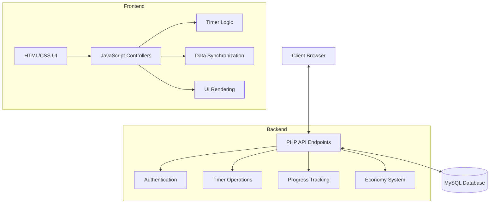
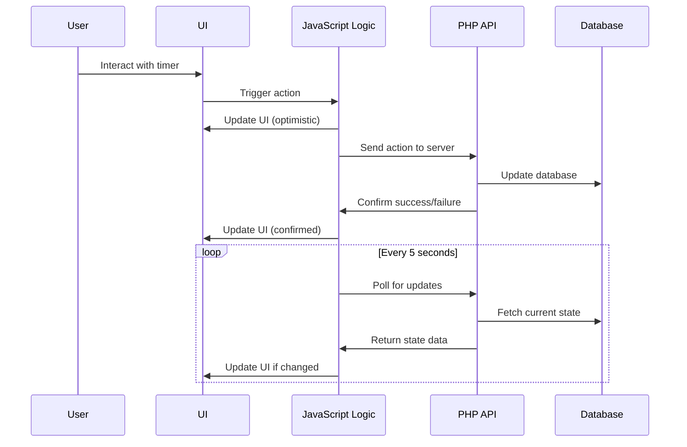

# System Patterns

## Architecture Overview
Timer8 Online follows a classic client-server architecture with a clear separation between frontend and backend:

## Key Design Patterns

### 1. State Management
- Client-side timers are maintained in a JavaScript object acting as a state store
- Polling mechanism periodically synchronizes client state with server
- Optimistic UI updates with server validation

### 2. Service-Oriented API
- RESTful PHP endpoints handle specific timer operations
- Endpoints are organized by function (timer actions, data retrieval, marketplace operations)
- JSON response format for consistent data exchange

### 3. Data Persistence
- MySQL database stores timer data, user progress, and economy information
- Timer state (running/stopped) and accumulated time are persisted to survive page refreshes
- Transaction-based updates to ensure data integrity for critical operations

### 4. UI Component System
- Template-based rendering for timer components
- Event delegation for efficient event handling
- CSS classes control visual state (running, stopped, pinned)

### 5. Interval-Based Processing
- Polling interval for server synchronization (5 seconds)
- UI tick interval for visual updates (1 second)
- Both optimized to balance responsiveness with performance

## Core Technical Components

### Frontend
- **HTML Templates**: Define the structure of timer components
- **CSS Styling**: Responsive design with visual state indicators
- **JavaScript Controllers**: Handle user interactions and timer logic
- **State Synchronization**: Keep client and server data in sync

### Backend
- **PHP API Endpoints**: Process timer actions and data requests
- **MySQL Database**: Store persistent timer and user data
- **Level System**: Track and manage user progression
- **Economy System**: Handle currency accumulation and spending

## Data Flow Pattern

## Error Handling Pattern
- Client-side error detection with retry mechanisms
- Server-side validation with descriptive error responses
- Grace period for network disruptions (timers continue running client-side)
- Console logging for development diagnostics
- User-friendly error notifications for critical failures 